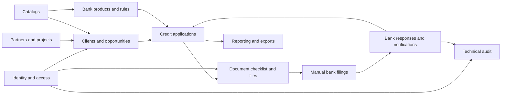

# Real Estate Credit Backoffice — Backend

Backend for an MVP that manages Colombian real-estate credit applications. It supports the internal operations backoffice and a buyer self-service portal: clients, opportunities, credit applications, documents, manual bank filings, and application tracking.

The API is implemented as a modular monolith with Django REST Framework and PostgreSQL. Functional, data, and API specifications are available in the root [`docs`](../docs/) directory.

## Technology Stack

- Python 3.11, Django 5.2, and Django REST Framework.
- PostgreSQL 16.
- Docker Compose for the local development environment.
- OpenAPI 3.1 and Swagger UI through `drf-spectacular`.
- Redis and Celery prepared for asynchronous work; they do not start by default.
- Pytest, Ruff, and MyPy for testing and code quality.

## Data Flow and Database Domains

The database contains 55 domain, configuration, security, and platform tables. The diagram below presents the main flow; each box represents a connected business area, not a single table.



## Backend Modules

| Module | Purpose | Main relationships |
| --- | --- | --- |
| `identity` | Internal users, roles, permissions, internal sessions, invitations, buyer magic links, and consent records. | Authorizes all other modules; buyer access is tied to clients and applications. |
| `catalogs` | Configurable business catalogs and reusable workflow transitions. | Provides options such as cities, purposes, reasons, and priorities to other modules. |
| `partners` | Construction partners, memberships, and real-estate projects. | Projects can be linked to CRM opportunities and application properties. |
| `crm` | Clients, addresses, opportunities, assignments, tasks, and business activity. | An opportunity belongs to a client and can become one or more credit applications. |
| `banking` | Banks, bank products, allowed purposes, and operational bank rules. | Applications select a product; document requirements use the bank-product context. |
| `applications` | Credit applications, participants, finances, income, property, financing preferences, assignments, and status history. | Central business record connecting CRM, banking, documents, and filings. |
| `documents` | Document types and requirements, checklist slots, private file versions, reviews, and ZIP package jobs. | Builds the application checklist and provides the evidence used in bank filings. |
| `filings` | Manual bank filings, immutable document snapshots, bank responses, and correction observations. | Uses application and document data; produces outcomes that notify buyers. |
| `notifications` | In-app notifications, delivery attempts, idempotency records, and outbox events. | Communicates application and filing events reliably. |
| `reporting` | Dashboards, operational reports, and export jobs. | Reads authorized data from CRM, applications, filings, and documents. |
| `audit` | Immutable technical audit events and request correlation. | Records sensitive actions performed across all modules. |

The complete table ownership, dependencies, and build order are documented in [the complete ERD](../docs/DER_COMPLETO_MVP_CREDITO.md#15-distribución-de-tablas-por-módulo-y-orden-de-construcción).

## Quick Start

### Prerequisites

- Docker Desktop running.
- Git.

You do not need to create or activate a local Python virtual environment. Python and project dependencies run inside the `backend` container.

### Environment Configuration

`.env` contains local-development values and must never be committed. Recreate it from the example file when needed:

```powershell
Copy-Item .env.example .env
```

### Start the Environment

From this directory (`backend`):

```powershell
docker compose up --build
```

To run services in the background:

```powershell
docker compose up -d --build
```

Default services:

| Service | Local address | Purpose |
| --- | --- | --- |
| Django backend | http://localhost:8000 | API and documentation. |
| PostgreSQL | `localhost:5433` | Local development database. |

Useful endpoints:

- [Health](http://localhost:8000/health): confirms that the HTTP process is running.
- [Ready](http://localhost:8000/ready): confirms that Django can connect to PostgreSQL.
- [OpenAPI schema](http://localhost:8000/openapi.json): API contract.
- [Swagger UI](http://localhost:8000/docs): interactive local API documentation.

## Common Commands

Run all commands from the `backend` directory.

```powershell
# Inspect service status and logs
docker compose ps
docker compose logs -f backend

# Stop services without deleting data
docker compose down

# Create and apply database migrations
docker compose exec -T backend python manage.py makemigrations
docker compose exec -T backend python manage.py migrate

# Validate Django configuration and migrations
docker compose exec -T backend python manage.py check
docker compose exec -T backend python manage.py showmigrations

# Run quality checks and tests
docker compose exec -T backend ruff check .
docker compose exec -T backend ruff format .
docker compose exec -T backend mypy config apps
docker compose exec -T backend pytest
```

To start Redis and the Celery worker when asynchronous features are being built:

```powershell
docker compose --profile async up -d
```

## Initial Structure

```text
backend/
├── apps/                 # Django applications organized by domain
│   └── identity/         # Internal users, roles, and permissions
├── config/               # Settings, URLs, health endpoints, and OpenAPI
├── Dockerfile
├── docker-compose.yml
├── requirements.txt
└── pyproject.toml        # Ruff and MyPy configuration
```

## Key Conventions

- Functional endpoints use the `/api/v1` prefix.
- Models use UUID primary keys.
- COP amounts are stored as integers, never as `float` values.
- Buyers do not have a permanent user account or password; they use magic links and temporary sessions.
- Business catalogs, bank products, and document requirements are backend-managed data, not frontend hard-coded lists.
- Never commit secrets, tokens, or `.env` files.

## Current Status

The technical foundation is operational: Docker, Django, PostgreSQL, OpenAPI, and the initial `identity` module with internal user, role, and permission models. Remaining modules will follow the documented build order.
